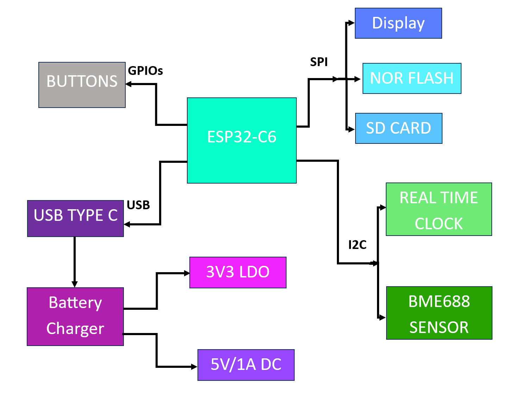
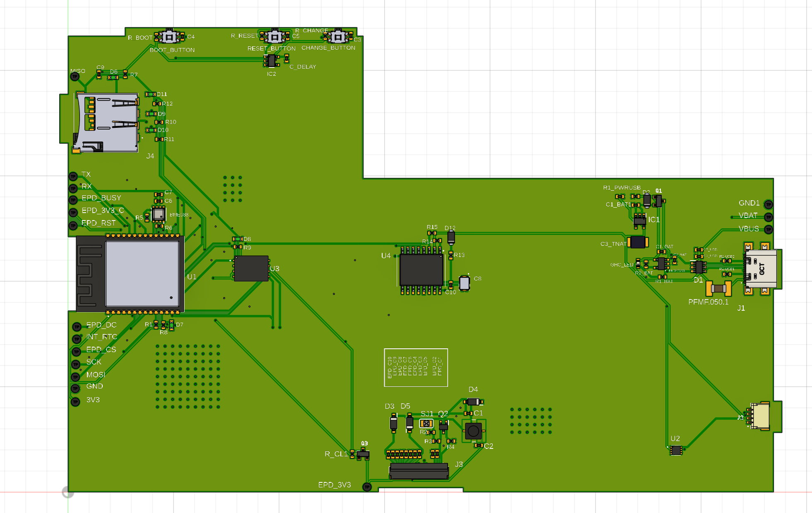

# Nicusor-Alexandru Zaharia 335CA – Open-Source E-Book Reader

## Description
**OpenBook** is a fully open-source, ESP32-C6-powered e-book reader designed to be affordable, customizable, and easy to manufacture. It features a crisp e-paper display, modular hardware, and full documentation – empowering developers and hardware enthusiasts to build their own e-reader from scratch.

The project contains the **Product Design** with a complete [`schematic`](Hardware/Schematic.sch), [`PCB`](Hardware/PCB_2D.brd) and [`3D Model`](Mechanical/Completed%203D%20model%20v1.f3z).

---

## Repository Hierarchy

- Hardware
  ├── Schematic file (.sch)  
  └── Board layout file (.brd)  

- Manufacturing
  ├── Gerber files archive (gerbers.zip)  
  ├── Bill of Materials file (.bom)  
  └── Pick and Place file (.cpl)  

- Mechanical
  ├── 3D model of the complete device (PCB + battery + display + case) – exploded view (.step)  
  └── Fusion 360 project file of the complete device  

- Images
  └── Renders of the device

- LICENSE  
- README.md  

---

##  E-Book Reader Block Diagram

---

##   Design Process

1.  **Schematic Design:** The schematic was meticulously designed to align with the project's specified requirements. It highlights the important `components and modules`.
    
2.  **PCB Redesign:** The PCB layout was generated based on the size of the enclosure, and `components were strategically placed` according to design guidelines and best practices.
    
3.  **Routing Implementation:** Routing was used on both the top and bottom layers of the PCB. `Signal traces` were set to a width of 0.15mm while `the power traces` were organized into a dedicated net class named `Power class` routed with a width of 0.3mm to ensure optimal power distribution.
    
4.  **Ground Plane and Via Stitching:** `Ground planes` were implemented on both the top and bottom layers. `Via stitching` was applied, particularly in proximity to the ESP module, to establish effective interlayer connections and minimize ground impedance. `Vias` were used to interconnect the ground planes.
    
5.  **3D Model Integration:** `3D models` of the components were found with the link to them at the bottom of the README, integrated into Fusion 360, and accurately placed on the `PCB layout` to facilitate mechanical design and visualization.
    
6.  **Enclosure Integration:** The PCB was integrated into its intended enclosure. The enclosure design was adapted to accommodate buttons, connectors, and other external interface elements. `Battery` and `display` 3D models were developed positioned within the enclosure to ensure proper fit and alignment.

7.  **Export and Manufacturing Preparation:** The final stage involved `generating all necessary manufacturing` documentation, including Gerber files, Pick and Place (CPL) data, and the Bill of Materials (BOM), to prepare the design for fabrication and assembly.

---

## Decision Making

I switched the original [battery](https://www.tme.eu/Document/e0683d8c34e6d878124489f71bffb6ee/cel0014.pdf) from cellevia batteries with a similar [one](https://www.elektronik.ropla.eu/pdf/stock/aky/aky0099.pdf) (same electrical parameters) from akyga with a size that enters well in the enclosure and beside that it also has a lifecycle of `500 charges` as opossed to only `300 charges`

---

## Component Description and Interaction

### Microcontroller

* **ESP32-C6-WROOM-1-NI (U2):** This is the core of the board, a powerful microcontroller with Wi-Fi and Bluetooth Low Energy (BLE) connectivity. It is responsible for controlling all other components, processing data, and external communication.

### Power Supply

* **Li-Po Battery Charging Controller (MCP73831):** This circuit enables the board to be powered from a Li-Po battery and manages the charging process when an external power source is connected via the USB-C connector.
* **USB C connector:** Provides the interface for powering the board and potentially for data transfer. Includes `ESD (Electrostatic Discharge) protection`.
* **LDO Voltage Regulator (XC8220A331MR-G):** An LDO (Low Dropout) voltage regulator is used to provide a `stable 3.3V voltage` required for powering most of the components on the board, derived from the battery voltage or USB.
* **Supercapacitor (CPH3225A):** A supercapacitor is present, possibly to provide a backup power source for certain critical functions, such as the RTC module, in case the main power supply is interrupted.
* **Reverse Polarity Protection (MBR0530):** Schottky diodes are used to protect the circuits against incorrect polarity connection of the power source.
* **Capacitors (electrolytic, tantalum, ceramic):** Various types and values of capacitors are used for `power supply filtering, decoupling, and temporary energy storage` at different points in the circuit.

### Display

* **E-Paper Display Header (FH34SR-24S-0.5SH):** A header connector is provided for connecting an `E-Paper display`. This type of display is known for its low power consumption and image retention without power.
* **Display Type Selector:** A set of pull-up/pull-down resistors connected to ESP32-C6 pins allows for the detection of the connected E-Paper display type.

### Sensors

* **Environmental Sensor BME688:** This sensor integrates `temperature, humidity, atmospheric pressure, and air quality` (VOC - volatile organic compounds) measurement functions. It communicates with the ESP32-C6 via the `I2C` interface.
* **RTC Module DS3231SN:** A Real-Time Clock (RTC) module that maintains accurate time and date information, even when the board is powered off, being powered by the supercapacitor or a small battery. It communicates with the ESP32-C6 via `the I2C interface`.
* **Battery Charge Level (MAX17048G+T10):** A dedicated integrated circuit for monitoring the charge level of the Li-Po battery. It communicates with the ESP32-C6 via the `I2C interface`.

### User Interaction

* **Boot/IO Button (BOOT BUTTON):** A button used to force the ESP32-C6 into bootloader mode for programming or to perform an application-specific function.
* **Reset Button (RESET BUTTON):** A button to reset the ESP32-C6 microcontroller.
* **Change Button (CHANGE):** A button with an application-defined functionality, for navigation or selection.
* **CHG LED:** An LED indicator for the battery charging status.

### External Memory

* **External NOR Flash 64MB (W25Q512JVEIQ):** An external `64MB SPI flash memory`, used for storing firmware, data, or additional resources required by the application, exceeding the ESP32-C6's internal flash memory capacity. Good to keep `more books to read`.

### Connectivity and Interfaces

* **USB C connector:** For power and potential data transfer.
* **E-Paper Display Header:** Dedicated connector for the E-Paper display.
* **Qwiic/Stemma QT Connector:** A standard `I2C connector that allows for easy connection of additional I2C-compatible sensors or actuators`.
* **SPI ESD Protection Lines:** ESD protection circuits for the SPI communication lines, used for the external flash memory interface.
* **Test Pads (TP1-TP17):** Test points distributed across the board to facilitate debugging and `signal verification`.

### Miscellaneous

* **GND:** Multiple ground points for ensuring a stable voltage reference.
* **Resistors:** Various resistors are used for `pull-up, pull-down, current limiting, and voltage division`.
* **Diodes:** Diodes with various purposes, such as `protection or rectification`.
* **Inductor:** An inductor, part of the `power supply circuit or for EMI filtering`.
* **MOSFETs:** MOSFET transistors used for power switching or other control functions.

##   ESP32-C6 Pin Usage

The following list details the ESP32-C6 pins used and the reason for their use:

* **Pin 10 (3V3):** Power supply pin for the ESP32-C6, connected to the 3.3V rail generated by the LDO.
* **Pin 8 (GHD):** A ground (GND) pin.
* **Pin 5 (GHD):** A ground (GND) pin.
* **Pin 20 (EN):** Enable pin for the ESP32-C6, controlled by a power management circuit or connected to a pull-up to keep it active.
* **Pin 21 (1011):** Connected to the BOOT button. It is configured as an input and used to initiate the ESP32-C6's bootloader mode at startup or reset. A pull-up resistor (R BOOT 10K) ensures a default high logic level, and pressing the button connects it to GND.
* **Pin 22 (1013):** Connected to the RESET button. Similar to the BOOT button, it's an input used to reset the microcontroller.
* **Pin 23 (1013):** Connected to the CHANGE button. It is configured as an input and used to detect user action. A pull-up resistor (10K) ensures a default high logic level, and pressing the button connects it to GND.
* **Pin 19 (102):** Connected to the SDA (Serial Data) line of the I2C bus. This line is used for bidirectional data communication with the BME688 sensor, the DS3231SN RTC module, and the MAX17048G battery monitoring circuit. Pull-up resistors will be present on the I2C bus.
* **Pin 18 (1015):** Connected to the SCL (Serial Clock) line of the I2C bus. This line provides the synchronization clock signal for I2C communication with the peripherals mentioned above. Similar to SDA, it requires pull-up resistors.
* **Pin 17 (132):** Connected to the CE (Chip Enable) pin of the external flash memory W25Q512JVEIQ. This pin is used to select the flash memory chip for SPI communication.
* **Pin 16 (10220):** Connected to the HOLD/RESET pin of the external flash memory. This pin has multiple functions related to controlling the write and read operations of the flash memory.
* **Pin 15 (10):** Connected to the WP (Write Protect) pin of the external flash memory. This pin is used to protect certain sectors of the flash memory against accidental writing.
* **Pin 14 (CE BAT):** Connected to the CE (Chip Enable) pin of the MAX17048G battery monitoring circuit. Used to enable communication with this circuit on the I2C bus.

**Pins Connected to E-Paper Display Header (FH34SR-24S-0.5SH):**

Several ESP32-C6 pins will be connected to the E-Paper display header to control and transmit data to it.

* Powering the display (via "EPD Power").
* Transmitting the data and control signals necessary for updating the image on the display. This could include pins for an SPI interface (data, clock, chip select) or another interface specific to the E-Paper display controller.

**Pins Connected to BME688 Sensor:**

* **SDA (connected to Pin 19 of ESP32-C6):** I2C data line.
* **SCL (connected to Pin 18 of ESP32-C6):** I2C clock line.
* **VDDIO:** Power supply pin for the sensor's logic interface, connected to 3.3V.
* **VDD:** Power supply pin for the sensor, connected to 3.3V.
* **CSH:** Chip Select pin for the SPI interface.
* **SCK:** Serial Clock pin for the SPI interface.
* **SDO:** Serial Data Out pin for the SPI interface.

**Pins Connected to DS3231SN RTC Module:**

* **SDA (connected to Pin 19 of ESP32-C6):** I2C data line.
* **SCL (connected to Pin 18 of ESP32-C6):** I2C clock line.
* **VCC:** Power supply pin, connected to 3.3V or the supercapacitor voltage to maintain RTC operation.
* **SQW/INT# (ALERT):** An output pin that can be configured as a square wave output or an alarm/interrupt output, connected to a GPIO pin of the ESP32-C6.

**Pins Connected to MAX17048G Battery Charge Level Circuit:**

* **SDA (connected to Pin 19 of ESP32-C6):** I2C data line.
* **SCL (connected to Pin 18 of ESP32-C6):** I2C clock line.
* **CE (connected to Pin 14 of ESP32-C6):** Chip Enable pin for selecting the I2C circuit.
* **ALERT:** An alert output pin that can indicate low battery level or other events, connected to a GPIO pin of the ESP32-C6.

**Pins Connected to W25Q512JVEIQ (U1) External Flash Memory:**

* **CS# (Chip Select):** Connected to Pin 17 of ESP32-C6.
* **CLK (Serial Clock):** An ESP32-C6 SPI CLK pin.
* **MOSI (Master Out Slave In):** An ESP32-C6 SPI MOSI pin.
* **MISO (Master In Slave Out):** An ESP32-C6 SPI MISO pin.
* **HOLD/RESET#:** Connected to Pin 16 of ESP32-C6.
* **WP# (Write Protect):** Connected to Pin 15 of ESP32-C6.

**Pins Connected to Qwiic/Stemma QT Connector:**

* **SDA:** Connected to Pin 19 of ESP32-C6.
* **SCL:** Connected to Pin 18 of ESP32-C6.
* **VCC (3V3):** Power supply for connected devices.
* **GND:** Ground.

---

## Images

  

---

## Bill of Materials

| Component                                        | Product Link                | Datasheet                        |
|--------------------------------------------------|-----------------------------------|-----------------------------------|
| ESP32-C6 WROOM-1-N8                              | [SnapMagic](https://www.snapeda.com/parts/ESP32-C6-WROOM-1-N8/Espressif+Systems/view-part/?ref=eda)         | [Datasheet](https://www.snapeda.com/parts/ESP32-C6-WROOM-1-N8/Espressif%20Systems/datasheet/)     |
| ESP32C6 Varistor 1812                            | [Mouser](https://ro.mouser.com/ProductDetail/EPCOS-TDK/B72520T0350K062?qs=dEfas%2FXlABIszF52uu7vrg%3D%3D)        | [Datasheet](https://www.tdk-electronics.tdk.com/inf/75/db/CTVS_14/Surge_protection_series.pdf)     |
| ESP32 WROVER 0805 Capacitor                      | [Mouser](https://ro.mouser.com/ProductDetail/KYOCERA-AVX/SD0805S020S1R0?qs=jCA%252BPfw4LHbpkAoSnwrdjw%3D%3D)         | [Datasheet](https://ro.mouser.com/datasheet/2/40/schottky-3165252.pdf)     |
| ESP32 WROVER BME680 Sensor                       | [SnapMagic](https://www.snapeda.com/parts/BME680/Bosch/view-part/?welcome=home)        | [Datasheet](https://www.snapeda.com/parts/BME680/Bosch%20Sensortec/datasheet/)     |
| ESP32 WROVER MCP73831 Power Management           | [Mouser](https://eu.mouser.com/ProductDetail/Microchip-Technology/MCP73831T-2ACI-OT?qs=yUQqVecv4qvbBQBGbHx0Mw%3D%3D)         | [Datasheet](https://eu.mouser.com/datasheet/2/268/MCP73831_Family_Data_Sheet_DS20001984H-3441711.pdf)     || ESP32 WROVER P-Channel MOSFET                    | [Component Search Engine](https://componentsearchengine.com/part-view/DMG2305UX-7/Diodes%20Incorporated)         | [Datasheet](https://www.diodes.com//assets/Datasheets/DMG2305UX.pdf)     |
| LED Chip 0603                                    | [SnapMagic](https://www.snapeda.com/parts/KP-1608SURCK/Kingbright/view-part/?ref=search&t=LED%200603)        | [Datasheet](https://www.snapeda.com/parts/KP-1608SURCK/Kingbright/datasheet/)     |
| SJ                                               | [GrabCad](https://grabcad.com/library/solder-jumpers-1)         | [Datasheet](https://en.wikipedia.org/wiki/HTTP_404)     |
| LTSPICE Resistor 0402                            | [Component Search Engine](https://componentsearchengine.com/part-view/R0402%201%25%20100%20K%20(RC0402FR-07100KL)/YAGEO)        | [Datasheet](https://www.yageo.com/upload/media/product/products/datasheet/rchip/PYu-RC_Group_51_RoHS_L_12.pdf)     |
| RCL CPOL 3528                                    | [SnapMagic](https://www.snapeda.com/parts/TAJB475K025RNJ/AVX/view-part/?ref=dk&t=capacitor%203528&con_ref=None)        | [Datasheet](https://s3.amazonaws.com/snapeda/datasheet/TAJB475K025RNJ_AVX.pdf)     |
| 112A-TAAR-R03                                    | [Comet](https://store.comet.srl.ro/Catalogue/Product/43497/)         | [Datasheet](https://store.comet.bg/download-file.php?id=27596)     |
| Capacitor 0402                                   | [Component Search Engine](https://componentsearchengine.com/part-view/CC0402MRX5R5BB106/YAGEO)         | [Datasheet](https://componentsearchengine.com/Datasheets/2/CC0402MRX5R5BB106.pdf)     |
| 744043680 IND                                    | [Mouser](https://eu.mouser.com/ProductDetail/Wurth-Elektronik/744043680?qs=PGXP4M47uW6VkZq%252BkzjrHA%3D%3D)        | [Datasheet](https://www.we-online.com/components/products/datasheet/744043680.pdf)     |
| BD5229G-TR                                       | [Component Search Engine](https://componentsearchengine.com/part-view/BD5229G-TR/ROHM%20Semiconductor)         | [Datasheet](https://datasheet.datasheetarchive.com/originals/distributors/Datasheets_SAMA/f2b9741ef86007909f138d561a359946.pdf)     |
| Custom Button                                    | [Panasonic](https://industry.panasonic.com/global/en/products/control/switch/light-touch/number/evqpuj02k)        | [Datasheet](https://industry.panasonic.com/global/en/downloads?tab=catalog&small_g_cd=203&part_no=EVQPUJ02K&q=RVZRUFVKMDJLJTdDMTMlN0MyMDMlN0MzNDU5JTdDMSU3QyU3QzIlN0M%3D)     |
| CPH3225A                                         | [SnapMagic](https://www.snapeda.com/parts/CPH3225A/Seiko+Instruments/view-part/?ref=eda)         | [Datasheet](https://www.snapeda.com/parts/CPH3225A/Seiko%20Instruments/datasheet/)     |
| DS3231SN RTC                                     | [SnapMagic](https://www.snapeda.com/parts/DS3231SN%23/Analog+Devices/view-part/?ref=eda)        | [Datasheet](https://www.snapeda.com/parts/DS3231SN%23/Analog%20Devices/datasheet/)     |
| FH34SRJ-24S-0.5SH Connector                      | [Component Search Engine](https://componentsearchengine.com/part-view/FH34SRJ-24S-0.5SH(99)/Hirose)        | [Datasheet](https://www.hirose.com/en/product/document?clcode=CL0580-1255-6-99&productname=FH34SRJ-24S-0.5SH(99)&series=FH34SRJ&documenttype=2DDrawing&lang=en&documentid=0000990903)     |
| MAX17048G+T10 Battery Fuel Gauge                 | [SnapMagic](https://www.snapeda.com/parts/MAX17048G+T10/Analog+Devices/view-part/?ref=eda)         | [Datasheet](https://www.snapeda.com/parts/MAX17048G+T10/Analog%20Devices/datasheet/)     |
| MBR0530 Schottky Diode                           | [SnapMagic](https://www.snapeda.com/parts/MBR0530/Onsemi/view-part/?ref=eda)        | [Datasheet](https://www.snapeda.com/parts/MBR0530/ON%20Semiconductor/datasheet/)     |
| PGB1010603MR Inductor                            | [SnapMagic](https://www.snapeda.com/parts/PGB1010603MR/Littelfuse/view-part/?ref=eda)         | [Datasheet](https://www.snapeda.com/parts/PGB1010603MR/Littelfuse%20Inc./datasheet/)     |
| QWIIC Connector                                  | [Mouser](https://eu.mouser.com/ProductDetail/Adafruit/4208?qs=PzGy0jfpSMtbScLbr0L5dw%3D%3D)        | [Datasheet](https://en.wikipedia.org/wiki/HTTP_404)     |
| USB4110-GF-A USB Hub                             | [Component Search Engine](https://componentsearchengine.com/part-view/USB4110-GF-A/GCT%20(GLOBAL%20CONNECTOR%20TECHNOLOGY))         | [Datasheet](https://gct.co/files/drawings/usb4110.pdf)     |
| SI1308EDL-T1-GE3 MOSFET                          | [SnapMagic](https://www.snapeda.com/parts/SI1308EDL-T1-GE3/Vishay+Siliconix/view-part/?ref=eda)        | [Datasheet](https://en.wikipedia.org/wiki/HTTP_404)     |
| TPTP20R                                          | [Comet](https://easyeda.com/component/7524403feb2642ac9f9f26dfb93ceacf)         | [Datasheet](https://easyeda.com/component/7524403feb2642ac9f9f26dfb93ceacf)     |
| USBLC6-2SC6Y USB Surge Protection                | [SnapMagic](https://www.snapeda.com/parts/USBLC6-2SC6Y/STMicroelectronics/view-part/?ref=eda)        | [Datasheet](https://www.snapeda.com/parts/USBLC6-2SC6Y/STMicroelectronics/datasheet/)     |
| W25Q512JVEIQ Flash Memory                        | [SnapMagic](https://www.snapeda.com/parts/W25Q512JVEIQ/Winbond+Electronics/view-part/?ref=eda)         | [Datasheet](https://www.snapeda.com/parts/W25Q512JVEIQ/Winbond%20Electronics/datasheet/)     |
| XC6220A331MR-G Voltage Regulator                 | [Component Search Engine](https://componentsearchengine.com/part-view/XC6220A331MR-G/Torex)        | [Datasheet](https://product.torexsemi.com/system/files/series/xc6220.pdf)     |

